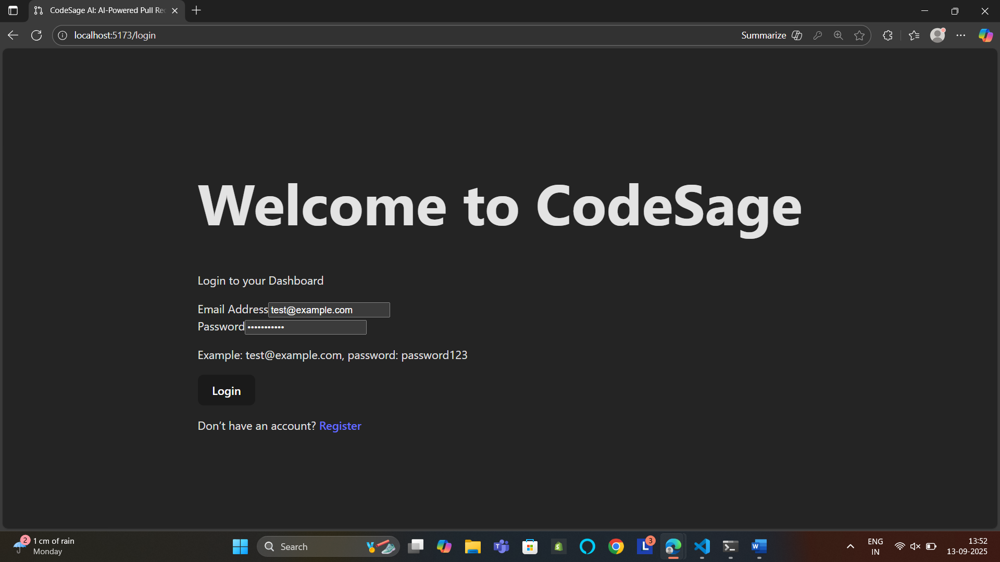
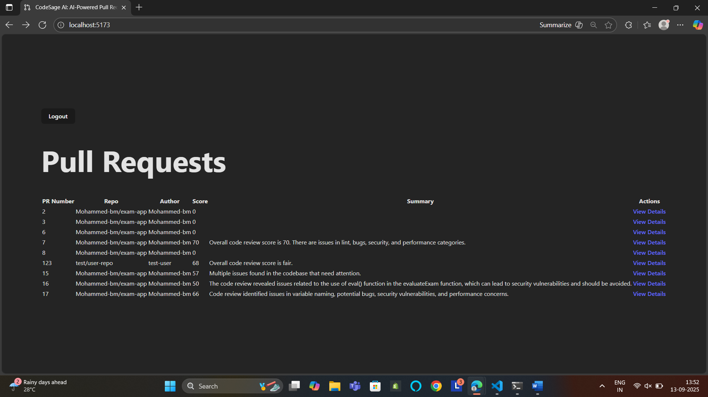
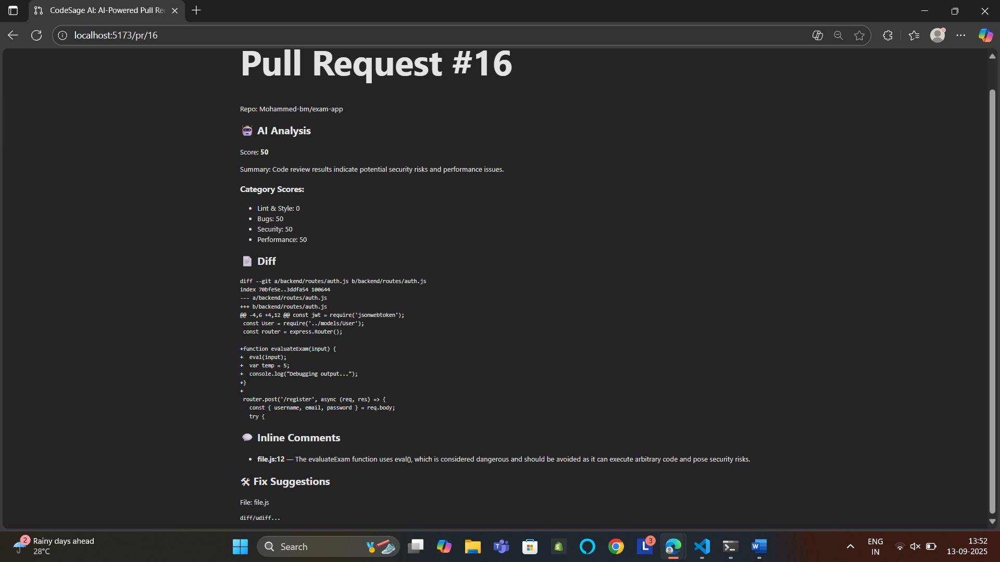
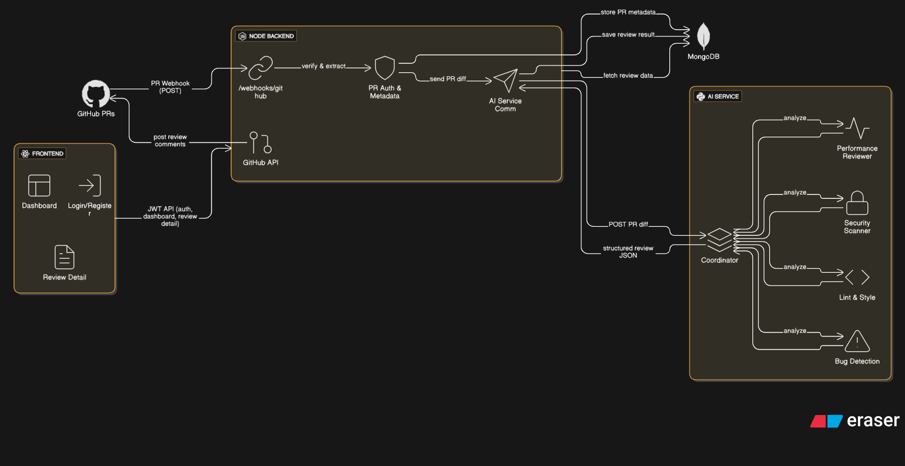

# 🧱 PR- Review

> **An AI-powered system to automatically review GitHub Pull Requests (PRs) in MERN projects.**  
> Automatically analyzes PRs for lint, bugs, security issues, and performance improvements, then posts actionable feedback back to GitHub.

---

## 🚀 Project Overview

This project is a **Proof of Work** demonstrating a full-stack application that automates code reviews for GitHub PRs using multi-agent AI.  
It helps developers improve code quality faster by providing automated feedback directly on GitHub.  
Designed with simplicity and scalability in mind, this project is built with Node.js, Python (FastAPI), React.js, and MongoDB.

---

## 🎯 Key Features

- ✅ Secure JWT Authentication for Dashboard login  
- ✅ GitHub Webhook listens for PR events  
- ✅ AI-powered analysis: Lint, Bugs, Security, Performance  
- ✅ Posts AI-generated review comments back to GitHub PR  
- ✅ Beautiful React Dashboard for reviewing PR history  
- ✅ Future improvements: GitHub OAuth, horizontal scaling, advanced caching

---

## ⚙️ Setup & Installation

### 1️⃣ Clone the Repo  
```bash
git clone https://github.com/your-/Mohammed-bm/pr-review.git
cd pr-review
```

### 2️⃣ Environment Variables  
Create `.env` files in each folder (`backend/`, `ai-service/`, `frontend/`) using this template:  

#### Example: `backend/.env`  
```env
PORT=5000  
MONGO_URI=[YOUR_MONGO_URI]  
JWT_SECRET=[YOUR_JWT_SECRET]  
GITHUB_WEBHOOK_SECRET=[YOUR_SECRET]  
GITHUB_TOKEN=[YOUR_GITHUB_PERSONAL_ACCESS_TOKEN]  
VITE_API_URL=http://localhost:5000/api  
```

#### Example: `ai-services/.env`  
```env
OPENAI_API_KEY=[YOUR_OPENAI_API_KEY]  
```

#### Example: `frontend/.env`  
```env
VITE_API_URL=http://localhost:5000  
```

### 3️⃣ Run Each Service (In Separate Terminals)

#### Backend (Node.js)  
```bash
cd backend  
npm install  
npm run dev  
```

#### AI Service (Python + FastAPI)  
```bash
cd ai-services  
pip install -r requirements.txt  
uvicorn main:app --reload  
```

#### Frontend (React.js)  
```bash
cd frontend  
npm install  
npm run dev  
```

---

## 📚 Usage Flow

1. GitHub PR →  
2. Webhook →  
3. Node Backend validates & saves PR metadata →  
4. Sends PR diff to Python AI Service →  
5. Receives analysis result →  
6. Posts review comments back to GitHub PR →  
7. Displays history & detail in React Dashboard

---

## 🌐 Deployment

Currently deployed on Render (Backend + AI) and Vercel (Frontend).  
Placeholders:  
- Backend URL → (https://pr-review-backend.onrender.com/)  
- AI Service URL → (https://pr-review-ai-nmkg.onrender.com/)  
- Frontend URL → (https://pr-review-jykpp6mfd-mohammeds-projects-619be64e.vercel.app/login)

---

## 📸 Sample Screenshots 

>  
- Screenshot: Login 

>  
- Screenshot: Dashboard listing PR reviews with score breakdown

>  
- Screenshot: GitHub PR with AI-generated review

>  
- Screenshot: GitHub PR with AI-generated review comments 

---

## 🏗️ Architecture Overview

This project has a simple but powerful architecture designed to automate GitHub PR reviews in an easy-to-understand flow, even for beginners.  
Here’s a brief explanation of how it works:

1. **GitHub sends a Pull Request event** to the Webhook endpoint in the Node.js backend.  
2. The backend verifies the event using HMAC SHA-256 signature and stores the PR metadata in MongoDB.  
3. The PR diff files are sent from the Node backend to the Python AI Service (FastAPI).  
4. The AI Service uses LangChain + LangGraph agents to analyze the PR for lint, bugs, security risks, and performance suggestions.  
5. The structured JSON result is returned to the Node backend.  
6. The backend posts the review comments and summary back to the GitHub PR using the GitHub API.  
7. Meanwhile, all PR reviews are saved in MongoDB and displayed in a React Dashboard with an intuitive UI.

### 📊 Architecture Diagram

>   

---

## 📜 License

MIT License © 2025

---

## ✅ Note

This project is primarily built as proof of work.  
Advanced features like GitHub OAuth, horizontal scaling, and caching are planned for future releases.
